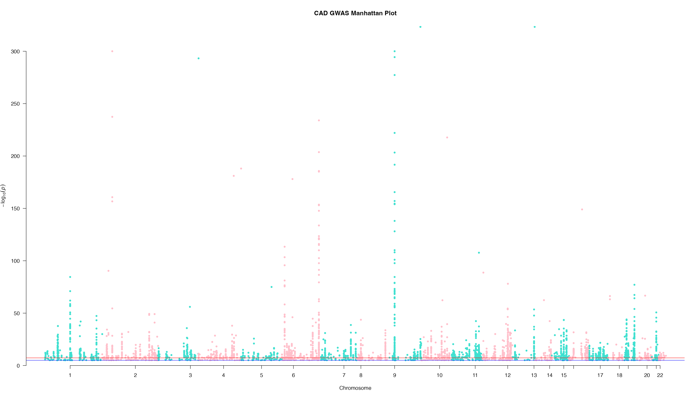
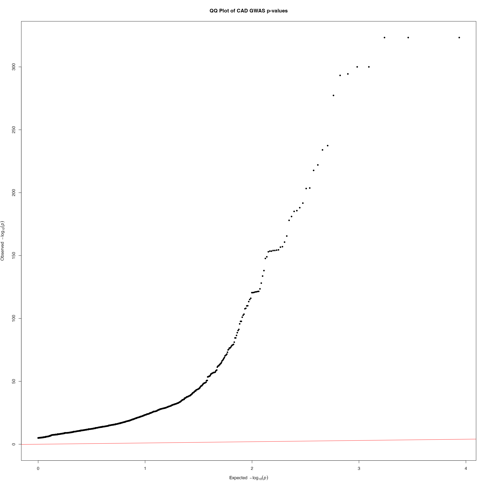

# Genome-Wide Association Study of Coronary Artery Disease

## Introduction/Quick Summary
In this project I will be analyzing the single nucleotide polymorphisms (SNPs) mutations from the coronary artery disease (CAD) genome-wide association study (GWAS) dataset obtained from the NHGRI-EBI GWAS Catalog. I will upload the SNP data to R, generate plots for visualization of the statistically significant SNPs, where SNPs are illustrated to be significantly associated with CAD via a qqplot and the most significant genes are observed in chromosomes 6 and 9 via a Manhattan plot. I will then identify the SNPs that meet the GWAS p-value threshold of 5 x 10^-8, overlap them with Ensembl gene IDs database, and then map the SNPs the matched gene name. HMCN2 and CDKN2B-AS1 (ANRIL) were the genes the with the most significant SNPs. HMCN2 is a gene which plays a role in cell adhesion, whereas ANRIL a noncoding RNA linked to human diseases. SNPs present on both play a role in CAD and other various heart conditions. Both HMCN2 and ANRIL are found in chromosome 9 as confirmed via GenomicRanges analysis and the Manhattan plot.
This workflow can potentially be useful in research and clinical settings as analyzing significant SNPs and their physiological results can help with the development of targeted gene therapy to treat chronic and life-threatening diseases such as various heart conditions.

The GWAS file can be downloaded here: https://www.ebi.ac.uk/gwas/efotraits/EFO_0001645

```r
#Install necessary packages
BiocManager::install(c("GenomicRanges", "AnnotationHub", "ensembldb", "EnsDb.Hsapiens.v75"))
install.packages(c("data.table", "qqman"))
```

```r
#Load necessary packages
library(data.table)
library(qqman)
library(GenomicRanges)
library(AnnotationHub)
library(ensembldb)
library(EnsDb.Hsapiens.v75)
```
```r
#Load file onto R
setwd("~/Documents/cad_gwas")
cad <- fread("cad_gwas.tsv")
colnames(cad)
```
Output
```text
[1] "DATE ADDED TO CATALOG"      "PUBMEDID"                  
 [3] "FIRST AUTHOR"               "DATE"                      
 [5] "JOURNAL"                    "LINK"                      
 [7] "STUDY"                      "DISEASE/TRAIT"             
 [9] "INITIAL SAMPLE SIZE"        "REPLICATION SAMPLE SIZE"   
[11] "REGION"                     "CHR_ID"                    
[13] "CHR_POS"                    "REPORTED GENE(S)"          
[15] "MAPPED_GENE"                "UPSTREAM_GENE_ID"          
[17] "DOWNSTREAM_GENE_ID"         "SNP_GENE_IDS"              
[19] "UPSTREAM_GENE_DISTANCE"     "DOWNSTREAM_GENE_DISTANCE"  
[21] "STRONGEST SNP-RISK ALLELE"  "SNPS"                      
[23] "MERGED"                     "SNP_ID_CURRENT"            
[25] "CONTEXT"                    "INTERGENIC"                
[27] "RISK ALLELE FREQUENCY"      "P-VALUE"                   
[29] "PVALUE_MLOG"                "P-VALUE (TEXT)"            
[31] "OR or BETA"                 "95% CI (TEXT)"             
[33] "PLATFORM [SNPS PASSING QC]" "CNV"                       
[35] "MAPPED_TRAIT"               "MAPPED_TRAIT_URI"          
[37] "STUDY ACCESSION"            "GENOTYPING TECHNOLOGY"
```  

I am interested in the columns "CHR_ID", "CHR_POS", "P-VALUE", the "SNPS" as these contain the SNPs, respective p-values, and the chromosome number and position each SNP is located on.

## Manhattan plot
A Manhattan plot is an illustraion that plots inidividual SNPs found in a dataset, where autosomal chromsomes (1-22) are represented on the x-axis and -log10(p-value) on the y-axis. They are called "Manhattan" as each plot resembles a "city skyline" where the taller the chromosome's corresponding SNPs are plotted, the more statistically significant it is. Therefore, it can be concluded that the chromosome possesses genes that exhibit a strong SNP signal in coronary artery disease.
```r
#Ensure P-VALUE is numeric (use backticks for the column name with a hyphen, otherwise R thinks it is a subtraction command).
cad$`P-VALUE` <- as.numeric(as.character(cad$`P-VALUE`)) 
#Ensure CHR_ID is numeric (introduces NAs for X, Y, etc.)
cad$CHR_ID <- as.numeric(as.character(cad$CHR_ID))
#Filter out the NAs before plotting (keeps only chromosomes 1-22)
cad <- cad[!is.na(cad$CHR_ID), ]
#Ensure CHR_POS is numeric
cad$CHR_POS <- as.numeric(as.character(cad$CHR_POS))
manhattan(cad,
          chr = "CHR_ID",
          bp = "CHR_POS",
          p = "P-VALUE",
          snp = "SNPS",
          col = c("turquoise", "pink"),
          main = "CAD GWAS Manhattan Plot")
```


Interpretation: This dots in this Manhattan plot represent each of the significant SNPs were found in each chromosome (Chr 1 – 22). Meanwhile, the horizontal blue line represents the p-value threshold (y = 5), and the red line represents the GWAS threshold (y = 8). Chromosome SNP dots are colored in an alternate fashion between turquoise and pink for visual ease and distinction. Multiple chromosomes show genome-wide significant loci, with the strongest signals on chromosomes 6 and 9.  The most significant SNPs in chromosomes 6 and 9 possess a -log10(p)-value of ~240 (10^-240) and ~320 (10^-320) respectively. These are extremely small p-values that reflect strong associations from large GWAS meta-analyses. Chromosome 13 also possesses a SNP at y = ~320, but it is most likely an outlier. Therefore, all chromosomes possess significant SNPs, with Chromosomes 6 and 9 possessing the most significant ones. 

## QQPlot
A qqplot will represent the correlation between the GWAS p-values and expected p-values. The more it lifts, the more statistical significance is observed in a given dataset.
```r
qq(cad$`P-VALUE`, main = "QQ Plot of CAD GWAS p-values")
```


Interpretation: This red line in this plot represents what the data distribution would look like if it followed the null hypothesis (no statistically significant SNPs in CAD). The CAD dataset plot (thick black) lifts significantly higher with each increased -log10 value, which illustrates that the dataset SNPs are statistically significant in CAD.

## Identifying genes
So far I have the SNPs and I would like to identify the genes they are located on. I want to identify the names of the genes the significant SNPs that meet the GWAS threshold of 5e-8 are located on, determine which chromosome these genes are located on, and determine the pathological consequence the SNPs on these specific genes contribute to. In order to do so I will need to access the Annotation Hub database, overlap and map my significant SNPs to the database's gene record, and then annotate.

```r
#I am interested in SNPs that meet the GWAS significance threshold (p < 5e-8)
#SNP identification and gene annotation
#Define the threshold
gwas_threshold <- 5e-8
#Subset the full “cad” data frame for all SNPs below the threshold
top_snps <- subset(cad, `P-VALUE` < gwas_threshold)
#Check how many significant SNPs found
nrow(top_snps)
```

Output
```text
[1] 3203
```
```r
#Make SNPs into GRanges (extension of IRanges that includes chromosome name (seqnames) and strand direction (+ or -)
snps_gr <- GRanges(
  seqnames = paste0("CHR_ID", top_snps$CHR_ID),
  ranges   = IRanges(start = top_snps$CHR_POS, end   = top_snps$CHR_POS),
  snp      = top_snps$SNPS
) 
snps_gr
```

Output
```text
GRanges object with 3203 ranges and 1 metadata column:
         seqnames    ranges strand |         snp
            <Rle> <IRanges>  <Rle> | <character>
     [1]  CHR_ID6  30956152      * |   rs9368648
     [2]  CHR_ID1 150531586      * |   rs4970935
     [3]  CHR_ID6  12903725      * |   rs9349379
     [4] CHR_ID12  57133500      * |  rs11172113
     [5] CHR_ID21  34221526      * |  rs28451064
     ...      ...       ...    ... .         ...
  [3199]  CHR_ID9 133266456      * |   rs2519093
  [3200]  CHR_ID6 133852013      * |  rs12202017
  [3201] CHR_ID10  30034963      * |   rs2487928
  [3202]  CHR_ID9 133266790      * |    rs514659
  [3203]  CHR_ID9  22125504      * |   rs1333049
  -------
  seqinfo: 22 sequences from an unspecified genome; no seqlengths
```
```r
#Access the hub
ah <- AnnotationHub() #latest set is from 2025-10-29 which is recent.
#Interested in Ensembl 
query(ah, c("Homo sapiens", "hg19", "Ensembl", "GRanges"))
```
Output
```text
AnnotationHub with 2 records
# snapshotDate(): 2025-10-29
# $dataprovider: UCSC, TargetScan,miRTarBase,USCS,ENSEMBL
# $species: Homo sapiens
# $rdataclass: GRanges
# additional mcols(): taxonomyid, genome, description,
#   coordinate_1_based, maintainer, rdatadateadded,
#   preparerclass, tags, rdatapath, sourceurl, sourcetype 
# retrieve records with, e.g., 'object[["AH5046"]]' 

            title         
  AH5046  | Ensembl Genes 
  AH98193 | human_database
```
```r
#I will use record "AH5046" as it contains the Ensembl gene annotations
genes <- ah[["AH5046"]]
genes
```
Output
```text
UCSC track 'ensGene'
UCSCData object with 204940 ranges and 5 metadata columns:
                        seqnames            ranges strand |
                           <Rle>         <IRanges>  <Rle> |
       [1]                  chr1 66999066-67210057      + |
       [2]                  chr1 66999275-67210768      + |
       [3]                  chr1 66999298-67145425      + |
       [4]                  chr1 66999823-67208882      + |
       [5]                  chr1 66999839-67142779      + |
       ...                   ...               ...    ... .
  [204936] chr19_gl000209_random       57208-68122      + |
  [204937] chr19_gl000209_random       70097-84658      + |
  [204938] chr19_gl000209_random       86746-96246      + |
  [204939] chr19_gl000209_random     147649-156298      + |
  [204940] chr19_gl000209_random     147649-156325      + |
                      name     score     itemRgb
               <character> <numeric> <character>
       [1] ENST00000237247         0        <NA>
       [2] ENST00000371039         0        <NA>
       [3] ENST00000424320         0        <NA>
       [4] ENST00000371035         0        <NA>
       [5] ENST00000468286         0        <NA>
       ...             ...       ...         ...
  [204936] ENST00000400854         0        <NA>
  [204937] ENST00000400848         0        <NA>
  [204938] ENST00000400846         0        <NA>
  [204939] ENST00000400827         0        <NA>
  [204940] ENST00000400829         0        <NA>
                       thick                            blocks
                   <IRanges>                     <IRangesList>
       [1] 67000042-67208778      1-25,864-986,92465-92528,...
       [2] 67000042-67208778      1-81,655-777,92256-92319,...
       [3] 67000042-67145425      1-58,632-754,92233-92296,...
       [4] 67000042-67208778 1-229,91708-91771,98931-98955,...
       [5] 67142780-67142779 1-213,91692-91755,98915-98939,...
       ...               ...                               ...
  [204936]       57249-67717        1-81,281-316,1183-1467,...
  [204937]       70108-83979      1-45,1045-1080,1825-2109,...
  [204938]       86746-95742        1-34,768-803,1566-1850,...
  [204939]     147649-153110        1-34,764-799,3291-3590,...
  [204940]     147649-156325        1-34,764-799,1542-1826,...
  -------
  seqinfo: 93 sequences (1 circular) from hg19 genome
```
```r
#Harmonize SNP chromosome naming to match the Gene annotation style (e.g., changing 'CHR_ID6' to 'chr6')
seqlevels(snps_gr) <- gsub("CHR_ID", "", seqlevels(snps_gr))
seqlevelsStyle(snps_gr) <- seqlevelsStyle(genes)
#Overlap
hits <- findOverlaps(snps_gr, genes)
#Mapping
snp_gene_map <- data.frame(
    snp_id = mcols(snps_gr)$snp[queryHits(hits)],
    transcript_id = mcols(genes)$name[subjectHits(hits)],
    stringsAsFactors = FALSE
)
#Annotating via EnsDb.Hsapiens.v75
edb <- EnsDb.Hsapiens.v75
my_keys <- as.character(unique(snp_gene_map$transcript_id))
my_keys <- my_keys[my_keys != ""] # Remove empty keys to prevent syntax errors
gene_info <- ensembldb::select(edb, 
                               keys = unique(snp_gene_map$transcript_id), 
                               keytype = "TXID", 
                               columns = c("SYMBOL", "GENEID"))
#FINAL MERGE
# Map symbols back to your SNPs
final_map <- merge(snp_gene_map, gene_info, 
                   by.x = "transcript_id", 
                   by.y = "TXID")
#Bring in the p-values from your original 'top_snps'
top_mapped <- merge(final_map, top_snps[, c("SNPS", "P-VALUE")], 
                    by.x = "snp_id", by.y = "SNPS")
#View top SNPs
final_results <- top_mapped[order(top_mapped$`P-VALUE`), ]
head(final_results)
```
Output
```text
         snp_id   transcript_id     SYMBOL          GENEID
31784  rs687621 ENST00000487727      HMCN2 ENSG00000148357
31785  rs687621 ENST00000455439      HMCN2 ENSG00000148357
25083 rs2891168 ENST00000421632 CDKN2B-AS1 ENSG00000240498
25091 rs2891168 ENST00000584020 CDKN2B-AS1 ENSG00000240498
25099 rs2891168 ENST00000421632 CDKN2B-AS1 ENSG00000240498
25107 rs2891168 ENST00000584816 CDKN2B-AS1 ENSG00000240498
            P-VALUE
31784 4.940656e-324
31785 4.940656e-324
25083 1.000000e-300
25091 1.000000e-300
25099 1.000000e-300
25107 1.000000e-300
```
Interpretation: The most statistically significant SNPs are rs687621 (4.940656e-324) and rs2891168 (1.000000e-300) found on genes HMCN2 and CDKN2B-AS1 respectively.

Next I want to identify which chromosomes these 2 genes are located on and compare the results to my Manhattan plot.

```r
#Indentifying chromosome location and position of HMCN2 and CDKN2B-AS1
query(ah, c("Ensembl", "Homo sapiens"))
```
Output
```text
AnnotationHub with 284 records
# snapshotDate(): 2025-10-29
# $dataprovider: Ensembl, BioMart, UCSC, FANTOM5,DLRP,IUPHA...
# $species: Homo sapiens, homo sapiens
# $rdataclass: GRanges, TwoBitFile, EnsDb, data.frame, list...
# additional mcols(): taxonomyid, genome, description,
#   coordinate_1_based, maintainer, rdatadateadded,
#   preparerclass, tags, rdatapath, sourceurl, sourcetype 
# retrieve records with, e.g., 'object[["AH5046"]]' 

             title                                  
  AH5046   | Ensembl Genes                          
  AH5160   | Ensembl Genes                          
  AH5311   | Ensembl Genes                          
  AH5434   | Ensembl Genes                          
  AH5435   | Ensembl EST Genes                      
  ...        ...                                    
  AH116860 | Ensembl 112 EnsDb for Homo sapiens     
  AH119325 | Ensembl 113 EnsDb for Homo sapiens     
  AH121554 | LRBaseDb for Homo sapiens (Human, v009)
  AH121801 | LRBaseDb for Homo sapiens (Human, v010)
  AH121953 | org.Hs.eg.db.sqlite
```

```r
#Select "AH119325" as it is the most recent record.
edb <- ah[["AH119325"]] 
#Find chromosome location, start and end position of HMCN2 and CDKN2B-AS1 
cad_gr <- genes(edb, filter = ~ symbol %in% c("HMCN2", "CDKN2B-AS1"))
#Print table
as.data.frame(cad_gr)[, c("symbol", "seqnames", "start", "end")]
```
Output
```text
                    symbol seqnames     start       end
ENSG00000240498 CDKN2B-AS1        9  21994139  22212895
ENSG00000148357      HMCN2        9 130265760 130434123
```
Interpretation: The most significant SNPs in the CAD dataset are found on Chromosome 9, specifically within the HMCN2 and CDKN2B-AS1 genes. These SNPs present on these genes are highly significant with p-values at 4.940656e-324 and 1.000000e-300 respectively, which confirms the observations within the Manhattan plot.

## Conclusion
Genome-Wide Association Study is a useful tool to analyze significant SNPs to identify the gene and chromosome source. Analyzing these genetic SNPs gives insight on the resulting phenotypic pathology that they produce. In the CAD dataset, chromosomes 6 and 9 were observed to possess the most significant SNPs. Mapping and annotating these SNPs to genes in the AnnotationHub database demonstrated the most significant SNPs that met the GWAS threshold of 5e-8 were found on HMCN2 (rs687621) and CDKN2B-AS1 (rs2891168) at p-values of 4.940656e-324 and 1.000000e-300 respectively. GenomicRanges analysis also demonstrated that both genes are located on chromosome 9, which confirms the observations of the Manhattan plot. Overall, GWAS is a useful tool to analyze disease-associated SNPs and identify their chromosome location and base pair position. This analysis can lead to the development targeted-gene therapies which can be used in clinical settings to treat life-threatening heart disease.

## Final Note
Analysis was performed using the R/Bioconductor ecosystem (qqman, GenomicRanges, AnnotationHub, ensembldb). AI tools were utilized to optimize code syntax and visualization parameters, while analytical interpretations and statistical validations were manually conducted to ensure biological accuracy.
